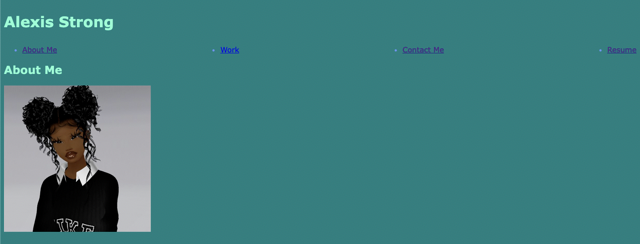

# Strong-Portfolio

## **Description**
This project allowed me to use what I've learned from advanced CSS styling setup a portfolio that displays my previoius work.  I was able to apply CSS layouts such as flex direction, justified content and alignment. 

- - - -
## **Table of Contents**
- [Usage](#usage)
- [Website Preview](#website-preview)
- [Credits](#credits)
    - [Markdown Reference](#markdown-reference)
    - [Avatar Picture](#avatar)
- [License](#license)
- [How to Contribute](#how-to-contribute)
- - - -
## **Usage**
To access my project, open my portfolio by clicking the "Srong Portfolio Link" shown in the [Website Preview](#website-preview) section below.
- - - -
## **Website Preview**
[Strong Portfolio Link](https://alexisstrong11.github.io/Strong-Portfolio/) 
- - - - 
## **Credits**
NOTE: *I participated in multiple study groups and received help from the instructor to assist with my  project.*

### Markdown Reference
[Markdown Cheatsheet](https://github.com/tchapi/markdown-cheatsheet/blob/master/README.md/ "Markdown Cheatsheet")

### Avatar
[Avatar](https://www.pinterest.com/pin/376895062572388684/ "Avatar")

- - - - 
## **License**
MIT License

Copyright (c) 2023 Alexis Strong

Permission is hereby granted, free of charge, to any person obtaining a copy
of this software and associated documentation files (the "Software"), to deal
in the Software without restriction, including without limitation the rights
to use, copy, modify, merge, publish, distribute, sublicense, and/or sell
copies of the Software, and to permit persons to whom the Software is
furnished to do so, subject to the following conditions:

The above copyright notice and this permission notice shall be included in all
copies or substantial portions of the Software.

THE SOFTWARE IS PROVIDED "AS IS", WITHOUT WARRANTY OF ANY KIND, EXPRESS OR
IMPLIED, INCLUDING BUT NOT LIMITED TO THE WARRANTIES OF MERCHANTABILITY,
FITNESS FOR A PARTICULAR PURPOSE AND NONINFRINGEMENT. IN NO EVENT SHALL THE
AUTHORS OR COPYRIGHT HOLDERS BE LIABLE FOR ANY CLAIM, DAMAGES OR OTHER
LIABILITY, WHETHER IN AN ACTION OF CONTRACT, TORT OR OTHERWISE, ARISING FROM,
OUT OF OR IN CONNECTION WITH THE SOFTWARE OR THE USE OR OTHER DEALINGS IN THE
SOFTWARE.
- - - - 
## **How to Contribute**
[Contributor Covenant](https://www.contributor-covenant.org/)